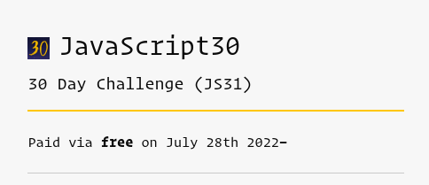
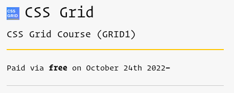

+++
title = '970 more to go'
date = 2022-11-29T15:08:07+02:00
draft = true
tags = [ "javascript", "coding", "first" ]
author = "jmchor"
ShowReadingTime = true
ShowBreadCrumbs = true
ShowPostNavLinks = true
ShowWordCount = true
ShowRssButtonInSectionTermList = true
UseHugoToc = true

[cover]
image = "img/cover.png"
alt = "<alt text>"
caption = "<text>"
relative = false
hidden = false
linkFullImages = true
+++

I remember the first time I ever heard about Wes Bos - I was probably putting our kid down for a midday nap, and in order not to be anxious to get out of there, I put in a podcast. I was fairly new to podcasts, but I had found one that was called CodeNewbie, and that seemed to really scratch an itch I had, namely: I don't know anybody who either is a coder, works in programming or has any knowledge about it (other than a colleague who I couldn't talk to because of work hours).

I listened to random episodes of the CodeNewbie podcast, and in the beginning those were mostly along the lines of "how did you get into coding" and "how do you do a career switch" and "where tf do you start?!". And I distinctly remember putting on an episode regarding JavaScript (cause at that time I felt pretty comfy with HMTL and CSS already in order to get my toes wet with some JS) - and it happened to be [The JavaScript First Responder with Wes Bos](https://www.codenewbie.org/podcast/the-javascript-first-responder). And I was awestruck, by the person of Wes Bos himself and by what he has accomplished so far.

> Spoiler: I am a regular listener to Wes' & Scott Tolinski's podcast Syntax.fm and basically a huge fanboy of the two of them

What interested me the most was JavaScript 30, a challenge that Wes Bos designed in order to build 30 little JavaScript-centered projects in 30 days. That was basically the answer to a question I hadn't even fully formed; I just knew that something like the #100DaysOfCode were alright for me (I mean, I did code a little bit every day) but what I lacked were the ideas of WHAT TO DO. So, JavaScript 30, here I come - but not for a while.

In April/May/June (can't pinpoint it exactly) I had started with The Odin Project, a free resource to get Web Developers on their way to Web Developing (that is at least what I wanted to use it for). So I didn't start JS30 yet because I was in the middle of the Odin Project Foundations Course - and I have that weird thing (which can be a huge hindrance at times) that I need to finish what I started before I can do something else. Not that anyone would force me - I think my fear is just if I don't follow self-taught stuff in a rigorous routine, I might as well just drop it. In this case, I should have started with JS30 right then and there. Nobody forces you to actually do it in 30 days.

    
    A screen capture of my JS30 course dashboard

On July 28th (one day before my birthday) I finally pushed myself to at least register for the course - but I got hooked and did one or two of the tutorials. And then, depending on how much time I had, or how captivating the curriculum from TOP Foundations were at the day, I exercised my ways through ten JS challenges, which were ALL incredibly fun, and some way more challenging than others. For example: every time the Event came into play somehow, I got confused. It also coincided that towards the end of the Foundations course there was a lot of talk about arrow functions and e.target and whatnot, so everything connected together nicely.

Around mid-August I was finally through the Foundations course - and it was around that time that I had seriously contemplated using a more guided approach to becoming a web developer, and had decided on the Ironhack part-time bootcamp. Because the annual visit to my wife's relatives in the States was coming up, I had been looking for a starting date later in the year, and so the start date of my bootcamp (which would be running for six months, three days a week, two evenings and one full Saturday) was set for November 29th.

What to do until then? I had three whole months of doing whatever I wanted!

> (It seems like we're getting off-topic a bit here, but please be assured that we'll get there!)

Thankfully, Ironhack obliged with what they call Pre-Work - essentially some basics and fundamental concepts you needed to internalize before even starting a bootcamp so everybody would be on the same level. The Pre-Work consisted mostly of setting up the coding environment (like getting familiar with git, setting up a database, setting up node/nvm, VSCode, etc.), HTML, CSS and basic JavaScript (which was a ton of freaking help, just to have a refresher of what I had learned weeks or only days before!). I got through the Pre-Work pretty quickly, and the little tests and projects were really fun to do. But then it was also time to pack our stuff and get on a plane to visit all the grandparents.

While over there, I coded a bit - I think I did one or two JS30 challenges, but mostly (since I could never pinpoint a time were I was undisturbed for an hour or so) I started on the Odin Project JavaScript Course and learned some more advanced basics.

After almost a month of running around the States and coming home and getting re-acquainted with not being jet-lagged and cuddling the cat until he almost hated us, I also got back to coding - but I mainly concentrated on my website-project at that time (which by now is being revamped yet again) and some very interesting learning opportunities for working with WordPress, which I wrote about here.

The days went by and I did a million little things, practicing techniques in VSCode, setting up a new OS (for some reason, Arch Linux is fun, but I do like it reliably easy sometimes too), setting up a new/old coding environment - basically procrastinating while coding.

Then I saw that the advanced Odin Project Course had a segment on CSS Grid, and I remembered that Wes Bos also had a free course on that - so I went ahead and powered through that (which was awesome and triggered the latest re-write of my website).

    
    I started the CSS Grid course end of October

And then I had like three-four weeks left before my bootcamp started, and I thought

> "Hm - not quite 30 days? I wonder..."

And that is when I started the JS30 challenge, only I had already done ten projects, and I didn't have thirty days. I blazed through them, sometimes working through three a day (multiple times so I could take in everything I didn't understand, and I learned a freaking metric ton.)

At first it was a bit rusty - I simply coded along, and tried (I did!) to pause the video after Wes described the goal of the project and challenged us to come up with a solution ourselves - but for the first three projects it just didn't click. Then it got better - I thought of ways to do stuff, wrote some stuff down, then coded along again. Some extra implementations there were no solutions for, like at the end of a video, was a nice to have - and at some point it just clicked and I was like "sure, you just need to do this and that and hook that up to that and - voila!" And that felt incredibly nice.

I learned a lot about HTML Media elements - and I learned that the essential skill (or one of the legion of essential skills) a developer needs to have is to know the category of tools needed to solve a problem. Not to have the perfect solution right then and there, but to look at what is there and what the desired outcome is, and then to think of the right buzzwords and triggers to at least google something and then arrive at

> "hey, in order to do this we could just access the whatever-API and BAM! internet success!

That's what I learned during an exercise involving a bunny video. It's just funny sometimes. And a ton more. All of the things that kind of made me turn away before - like e.target, just to name one, suddenly came to me as naturally as putting something a strong-tag to make it bold (kidding!). I had a little fear that by just working through them so many at a time that nothing would stick - but the exact opposite is true. Because I immersed myself so deeply into doing nothing but those challenges for twelve days or so I picked up so, so much.

And then I was done and watched the 31st video, where Wes Bos congratulates you (unless you just skipped to the end) and after stating that it takes 1000 projects to get good he says

> and now you have 970 more to go

I had to laugh, because that seemed so ridiculous a number - but also, who's counting? Even the next day I set down and thought about what I could build. I came up with the idea to build my own Markdown-to-Text-Editor, but soon switched over to having a little text renderer that could change font styles between bold and italic and could strike through single words or a whole paragraph. The Regex for converting the markdown was just too much for me at that point.

The next day I read something about a password generator on Reddit; I sat down at my computer, and after three hours I had a nice little functioning password generator. I tweaked it here and there and deployed it on Netlify because that's what you do with things you like, right? You show them off.

I've been doing tons of other stuff in between then and now - no new projects, sure, but I got prepared for my first day of studies, I set up this blog, I got to know a little more about TypeScript, I tweaked and cleaned up my VSCode - just maintaining.

But the 970 projects will definitely stick in my mind. Or should I say, 968 more to go?

jmc