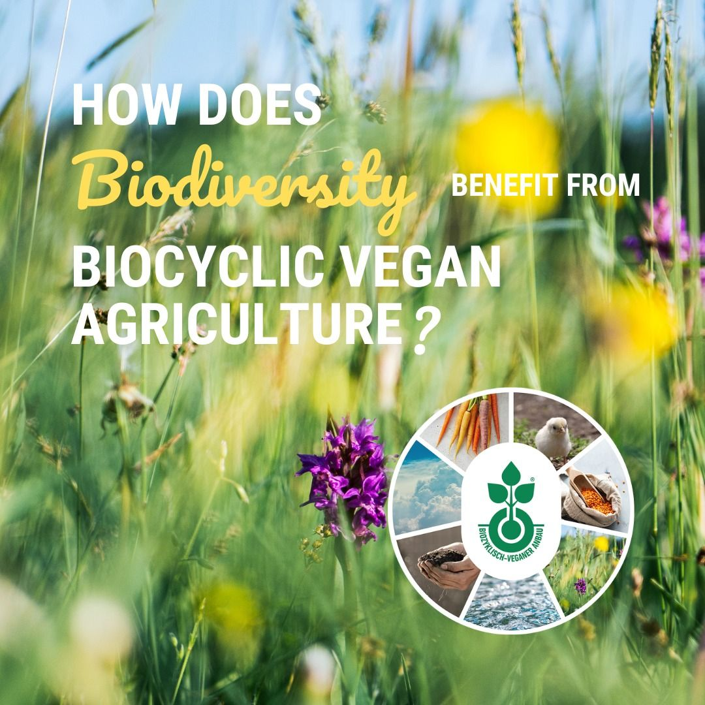
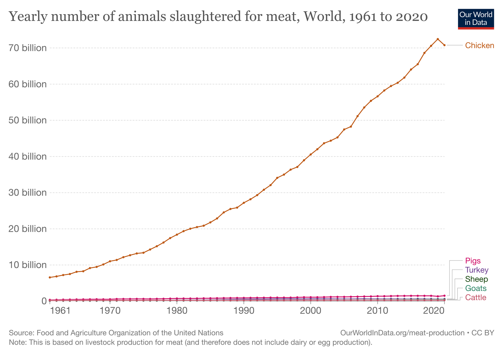
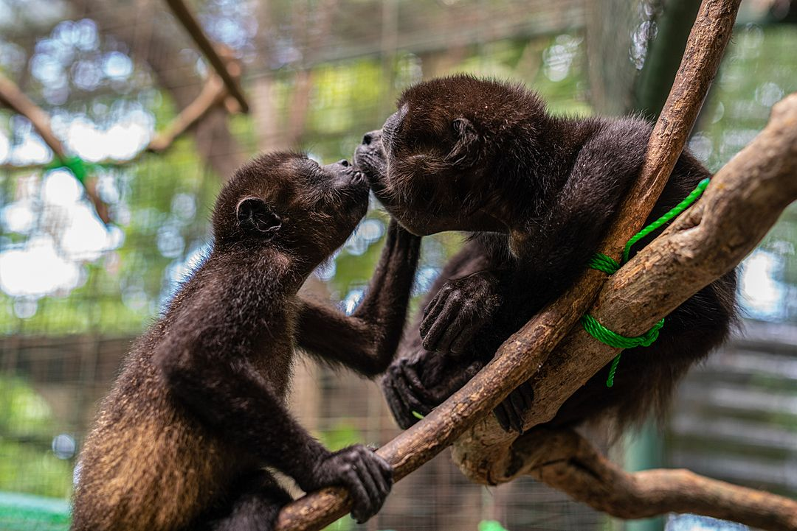
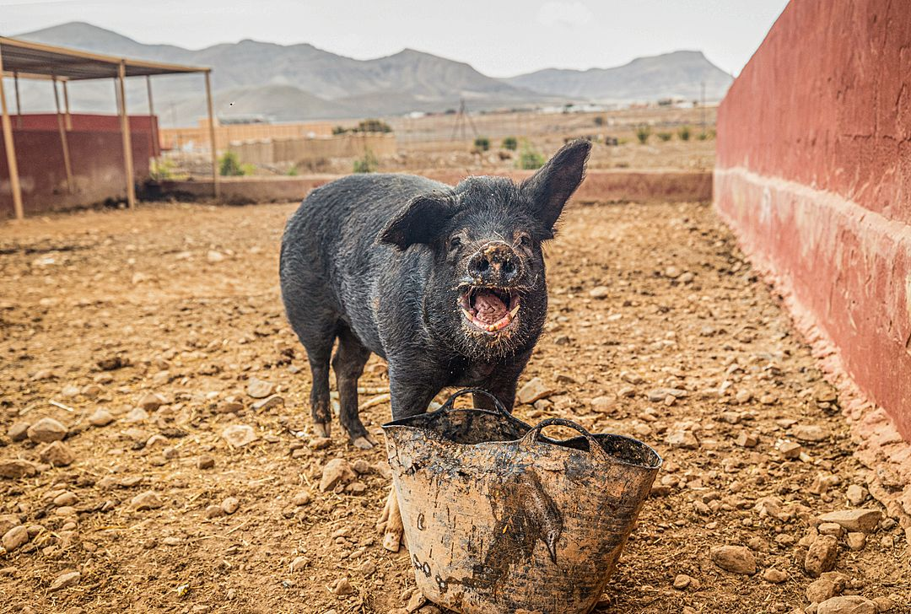
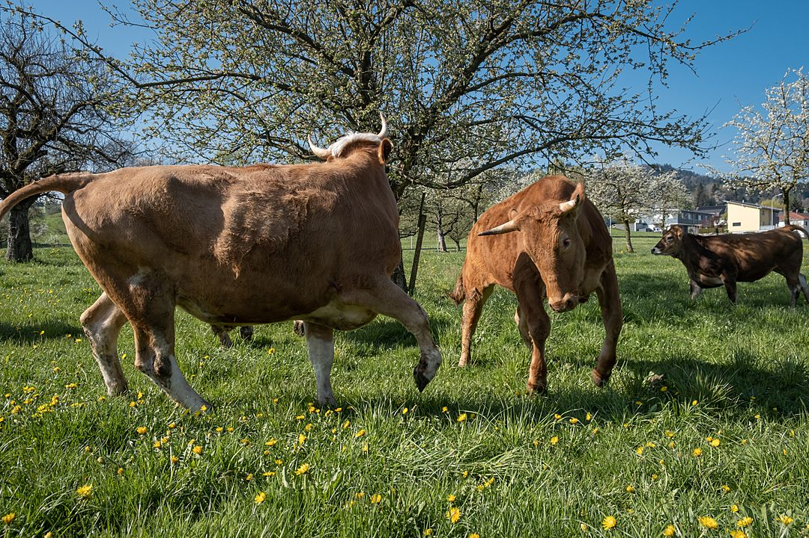
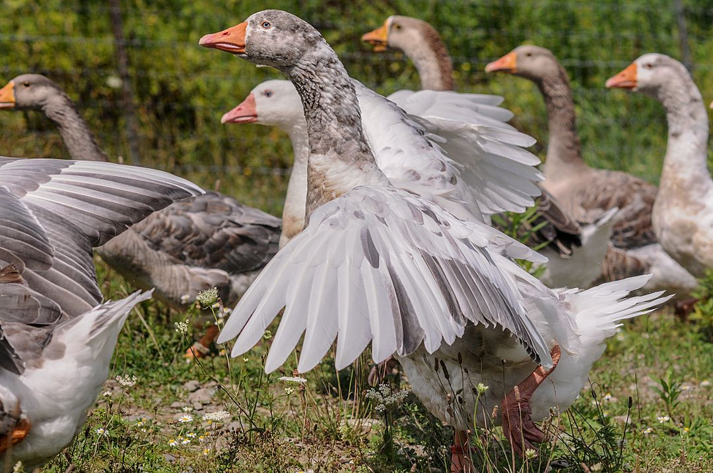

+++
title = "Live like you give a damn."
slug = "giving-a-damn"
date = 2023-01-22T07:15:14+02:00
draft = false
tags = ["veganism", "animal rights", "ethics"]
categories = ["veganism"]
author = "jmchor"
ShowReadingTime = true
ShowBreadCrumbs = true
ShowPostNavLinks = true
ShowWordCount = true
ShowRssButtonInSectionTermList = true
UseHugoToc = true

[cover]
image = "img/cover.jpg"
alt = "<alt text>"
caption = "<text>"
relative = false
hidden = false
linkFullImages = true
+++

The internet is full of blogs, full of people throwing their opinions and experiences out there.

Well, here's mine: the vegan section of my blog.

My goal is not to be a vegan blogger. I decided to make part of my blog be about _veganism_ because it's a defining part of my personality - and this is a personal blog. I write about the stuff that moves me, and that I can actually write about, because there is progress and process

> I said to my partner the other day, **you know**, I try to have like four or five things I like to do in my "free" time (meaning time I spend by myself). That's coding, drumming, reading, running, and spending my time on activism - that could be working on volunteering, contributing to activism, etc. So, I also could have decided to write about reading, drumming or running. But the truth is: I don't see a point in me dedicating a whole section to these topics. With activism this is a different story - especially since I view blogging, communication and the dissemination of information as a central part of how I participate in activism. I have worked in a climate justice activist group, and it is part of who I am, but it never was **my** thing. With veganism, I feel very much that it is **my** thing to write about.

So, I decided for myself to write about what moves me about veganism, about being (a) vegan and following a vegan philosophy.

> And why yet another blog from a person on why they don't eat animals?

Because I subscribe to the notion that we are a communicative species and thanks to the internet, everyone could potentially talk to everyone. I'm **not** saying you **need to read** what I put out there. (I realize this blog is called **Read My Shorts** - but technically speaking, I can't _make_ you.) I'm just saying: _I'm putting it out there._

## Isn't "vegan" just another label?

No. But also, yes. I mean, of course it is. It is also much more than that.

As humans, we label everything we encounter - we do that in every cultural sphere because it makes interactions between beings a matter of learned behaviour rather than an adhoc evaluation every time we see another being. Meaning: we use stereotypes so we don't have to reinvent the wheel in every situation.

For most people, "vegan" designates a person who doesn't consume flesh*, eggs or secretions* . (Actually I had to learn that a lot of people don't know the difference between a vegetarian and a vegan diet). For me, that label "vegan" meant exactly that. Also, to me there was an air of militancy or rigidity surrounding that word. But I also didn't know any vegans.

 *meat and dairy may be the usual terms we encounter when talking about animal flesh and the food items that are made with the secretions of their milk ducts. Naming the items as such (flesh and secretion) in my opinion tears off the fake veneer by which the carnist food industry is trying to normalize the consumption of dead beings or the nutrition intended for their offspring

 **this description is deliberately chosen. The planet will survive about any climate crisis. But humans won't, thus making the climate crisis a crisis of animal life on earth, human and non-human

---

Fast forward many, many years. I came to veganism via environmentalism and the climate justice movement. Animal agriculture and factory farming are a, if not the, leading cause of the climate crisis, and so I got into researching all of the horrendous numbers and facts about that. But I also encountered discouraging tendencies in the climate justice movement saying that an individual's choice of diet doesn't do much if we don't all do it. I didn't dwell too much on that, but I was already pretty much on a plant-based diet - just because it won't help the climate crisis doesn't mean I can't do it, right?

My internal motivation changed over time. It's not that I became less of an activist for climate justice (while still advocating for the movement I did work less on actual campaigning) - I became more of an activist for veganism. I can't exactly say what prompted me, but I read Jordi Casamitjana's book _[Ethical Vegan](https://septemberpublishing.org/product/ethical-vegan/),_ and that did it for me. I opened my eyes to the fact that even mosquitoes don't sting us out of malevolence or spite but to eat and to nurture their offspring - and what makes them less entitled to life than me? But I'm going on a tangent here.

So, vegan activism came more into focus for me, so I tried doing more work for an [NGO](https://biozyklisch-vegan.org/) my partner and I are part of, which is concerned with the promotion of **biocyclic-vegan** or **veganic** farming. That was a good first step, and of course, more shall follow. Which is why I decided to start a new section of my blog concerned with vegan activism. Which brings me back to the label-thing.

To me, **now that I know more**, there is a huge difference between being plant-based and being vegan. Just like every square is a rectangle, not every rectangle is a square - every vegan is plant-based, but not everyone who's plant-based is vegan. That is because for me to be vegan means to be outspoken about it. It means to be advocating for something to do with veganism - attending protests, organizing events, volunteering at an animal sanctuary, what have you. It's like being a _tech evangelist_ but for **not murdering someone**. Being vegan means to not make exceptions at a restaurant or at a friends house (exceptions for convenience), for honey (exceptions for taste and culture), or even for saved food. If you give your saved animal products to a carnist, chances are the carnist will not buy more of those products right away, and thus maybe lower the demand for new product.

I have no problem with anyone on a plant-based diet. I also don't have a problem if those anyones describe themselves as vegan because of it - it just means that maybe we need to have a conversation about it and see if there are misunderstandings. I just don't like people playing jump rope with those terms. Fact is that eating plant-based and being vegan cease to be synonymous at some point - and the point is when we come to the conclusion, each for themselves, that it's not just about health or money or whatever reason but about the war on animals, the [First Extermination](https://truthout.org/articles/this-is-not-the-sixth-extinction-its-the-first-extermination-event/) and the death of our planet**.

---

### What being vegan means (to me)

To be vegan means to follow the philosophy of (ethical) veganism and that includes following a vegan diet. A vegan diet is a _plant-based_ **** diet which is informed by the core vegan principle which holds that **the unnecessary exploitation of animals for whatever reason is morally unjustifiable and ethically wrong**. A _plant-based_ diet therefore doesn't necessarily make the dieter a vegan; it could be informed by many reasons, like the improvement of _health_*, a dislike of _taste_, various _environmentalist_ principles - and so on. For food items,  I'm more comfortable with the label "vegan friendly" or "compatible with a vegan diet" - it is in a way less confusing after the initial confusion of actually discerning the two terms has been overcome.

 *whenever I mention a plant-based diet here, I implicitly mean a healthy, well-planned diet. Like whole foods, nuts, fruits and vegetables, not whole rolls of Oreos and french fries. (Nothing against Oreos or french fries.)

The main point is:

> veganism is a philosophy that needs to be actively and distinctively enacted and kept in mind by the person adhering to it. Being plant-based means eating plants.

The term _philosophy_ might suggest to some that veganism is some sort of belief*, which in turn would move veganism into the realm of religious dogma or make it appear to be unfounded in fact - while the opposite is true.  Various studies have shown the positive impact of veganism on the [lives of animals](https://youtu.be/BqyiSnhV11I), our [environment](https://www.mdpi.com/2071-1050/11/15/4110/htm) and [societal development](https://www.sciencedirect.com/science/article/pii/S2666833522000612) - mostly in the form of dietetic change and vegan activism. Further, studies have postulated the positive impact veganism could have for our [animal companions](https://www.mdpi.com/2673-4060/1/2/10), our planet's ecology and our [future](https://www.raco.cat/index.php/AER/article/download/393383/486838) on it.

 * It could be a bit confusing since in the UK, veganism is protected as a <a href="https://www.bbc.com/news/uk-50981359" target="_blank">philosophical belief</a>. This is not to argue that veganism is a belief system but to protect veganism within the same legal framework as religious practice against discrimination.

    
    Veganic farming as a means to improve ecology and animals' lives

We're talking about **facts**, and in the case of the abhorrent abuse of animals on factory farms, in slaughter houses and abattoirs - courtesy of hours of footage obtained by animal rights activists fighting against industry efforts such as [AG-GAG](https://en.wikipedia.org/wiki/Ag-gag) laws and shown to the public in films like [Dominion](https://www.dominionmovement.com/watch) - actual proof.

Veganism is not a tome of teachings from the mouth of a prophet which people accept without second thought or criticism (nor should they). In fact, I would argue that it veganism stands for the exact opposite of that - to follow vegan philosophy, to be vegan, means to **second-guess** the ubiquitous attitude of  _**carnism** - the dominant belief system of eating animal flesh._ It means to criticize the unquestioned adherence to a culture that, through some kind of _warped logic,_ inextricably links societal dependency on animals with animal cruelty.

To be vegan means to question many forms of authority.

To be vegan means to question ourselves and our actions in this world.

Veganism is based on a shared concept of **morality** - morality isn't subjective, no matter what it is based on; there's no difference if we link our morality on religious teaching or humanism - it (usually) boils down to "is it morally justifiable to hurt, harm, torture, maim, injure or murder a fellow sentient being without necessity".

And it just isn't. And to then proceed and do so, on a daily basis, be it through direct action or by demand _****_ for supply, is supremely illogical, selfish and cruel.

---

### The little word "unnecessary"

It seems like a loophole that carnists will use and abuse like they silently (or maybe vociferously?) condone the use and abuse of animals: the necessity of exploitation. But I won't engage that whole nonsense.

Necessity for the exploitation of animals means - simple enough - an existential roadblock a human might find themselves before. Something they simply cannot get around. Which means: I am not attacking some people who live in remote places with dry soil and no other means of sustaining themselves but to hunt an animal or keep an animal for their secretions. Of course not - even in a non-human-centric philosophy like veganism the human is still at it's core; it's about what HUMANS do about the exploitation of animals, and how HUMANS conduct their way of life. Hermits who **have**  **to kill to survive** are not the ones perpetuating the horrific practice of factory farming. That is done by the rest of us, by supply and demand, capitalism, greed, cruelty, convenience and tradition.

There is a well-used scenario carnists will often throw in vegans faces when they don't sincerely want to debate veganism but want to ridicule everything because they sense they're in the wrong.

That scenario is a vegan stranded on a deserted island (or any variation of this). The only other inhabitant is an animal, a pig, for instance. Would this vegan slaughter this pig for food to survive?

Probably. But what is gained by this thought experiment? That humans do whatever is necessary to survive? That is not news, that is basically evolutionary biology. What on the other hand is everything but evolutionary biology - and as far removed from nature or survival situations - is factory farming and large-scale animal agriculture. An industry built up to force sentient beings into existing, torturing and maiming them, rendering their life a living hell, and when we have exploited the last drop out of their enslaved bodies - murdering them. By the _billions_. For convenience, not survival.

    
    An estimated 79 billion land animals were murdered for food in 2020

In our western society (I can't speak for any other) we very rarely find ourselves in a situation where we find ourselves with our backs against the wall and no option to ensure our most **basic** survival other than to murder an animal - to eat their flesh. **It just doesn't happen**. It's not a realistic scenario for most of us. But if that is the case - then the word "necessity" comes into play. Humans, as do all animals, want to survive. So we do a lot in order to achieve that.

The [Vegan Society](https://www.vegansociety.com/) has a a great definition on what veganism entails:

__**"Veganism is a philosophy and way of living which seeks to exclude—as far as is possible and practicable—all forms of exploitation of, and cruelty to, animals for food, clothing or any other purpose; and by extension, promotes the development and use of animal-free alternatives for the benefit of animals, humans and the environment. In dietary terms it denotes the practice of dispensing with all products derived wholly or partly from animals."**__

_"As far as possible and practicable"_ - in our, or at least my, day to day life it is extremely easy and practicable to avoid animal exploitation and torture - it's right there in the aisle with the refrigerated goods. Of course I have an abundant amount of privilege and can easily pick and choose. But a lot of people, globally speaking, are still not in survival situations where the slaughter of animals is necessary. And yet, oftentimes, people will just turn "as far as possible and practicable" on their heads and try to use their culture, their tradition, their convenience and their taste preference as valid arguments.

## So what is this all about then?

Or in other words - instead of what **not** to do, what **can** we do? What **should** we do?

> Following a vegan philosophy allows us to embrace the whole world. It allows us to widen our circle of compassion.

    
    Credit: Thomas Machowicz / We Animals Media

> It helps us  understand that every living being deserves the same respect, deserves to experience the same joy and sadness and happiness and sense of contentment as those humans we love most.

    
    Credit: Andrew Skowron / We Animals Media

> It helps understand that every sentient being feels pain, flees from danger into the loving arms of family and the protection of their loved ones.

    
    Credit: Sabina Diethelm / We Animals Media

> It helps us accept this feeling of kinship with human and non-human animals alike, when our world suddenly grows larger because we truly regard every life to be worth the same.

    
    Credit: Jo-Anne McArthur / We Animals Media

Veganism enables us to view the world as a whole and develop a deep respect for life. Veganism also instills in us a desire to change, to help, to **advocate** for the voiceless and to fight those structures built on the exploitation, torture and murder of billions of living beings.

Veganism is not about taste, health, ease or cheap food items. It's about **respecting** all sentient beings' **rights to live**, to alleviate pain and suffering and to **advocate** for those that can't speak for themselves regardless of any benefit to yourself.

To be vegan means that in the _war on animals_, we take the side of the **oppressed**.

jmc
