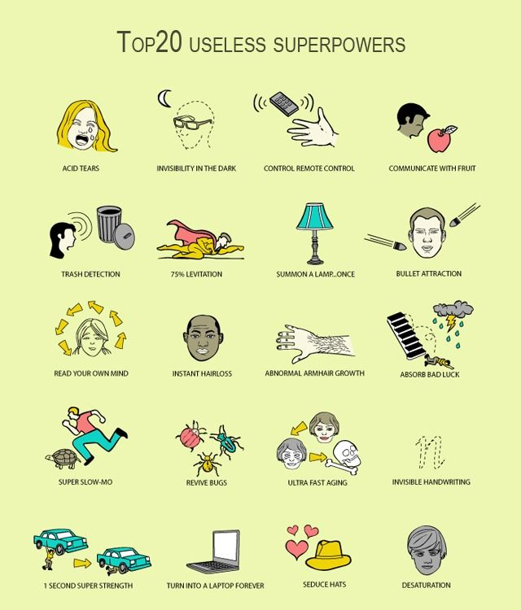

+++
title = 'The Ironhack Experience'
date = 2023-06-29T13:36:56+02:00
draft = true
tags = [ "coding", "javascript", "web development" ]
author = "jmchor"
ShowReadingTime = true
ShowBreadCrumbs = true
ShowPostNavLinks = true
ShowWordCount = true
ShowRssButtonInSectionTermList = true
UseHugoToc = true

[cover]
image = "img/cover.png"
alt = "<alt text>"
caption = "<text>"
relative = false
hidden = false
linkFullImages = true
+++

And so it begins - after waiting for almost six months, anticipation, and yes, in the last week or so - stress (almost), Day 1 of my Web Development Bootcamp experience is drawing closer. On November 29th I will sit in the "remote campus" (aka my home in front of my screens) and will receive my first ever face-to-face (Screen-to-screen?) lesson on web development.

So far in my learning-how-to-code-career it went from reading books to reading other books to reading StackOverflow to Google to Udemy (a bit) to CS50 (for 20 minutes) to listening to podcasts to video tutorials (mostly by **Wes Bos**) - to here.

For the last two weeks or so, "here" has been a state of weird alertness and a feeling of needing to cram as much knowledge in my face as I possibly could. I wanted to be prepared for the bootcamp and know as much as possible - I checked with the curriculum to see what will be the plan over the next few weeks. My reaction was mixed - halfway between "oh, awesome, I already know how to do that, that'll be great practice!" and "oh, man, **Bootstrap**? I don't know how to do that - why wouldn't they use Grid? Bootstrap?!" followed by multiple Google sessions trying to learn how fast you can get to know Bootstrap or Sass or - y'know.

But then, that stopped for some reason. I arrived at the thought that the bootcamp is actually the place to TEACH me that kind of stuff. So for once in my life I actually sat down and stopped worrying. Sure, I checked out things like **SASS** and **Stylus**, just to get to know the process of a CSS preprocessor for sure, and I sat down and actually learned how to properly set up **ESLint**. And then I sat down and started working on **TypeScript**, because why not? I was prepared for the first day of bootcamp, I had done all of my Career Hack prep and the prework for the first module - now it was time to do some stuff other than cram.

I recently had finished Wes Bos' JavaScript 30 (more on that in another post), and while it was a lot of fun and a great learning experience - I was pretty bummed when it was over. Mainly because now I was sitting there thinking "and what should I build now?". Wes'  message in the las video was to build a thousand projects to get great at JavaScript, and now we had done the first 30 - only 970 to go. So what I did was to keep my eyes open for ideas - and then I built **two things**! And it was - time consuming and just incredibly fun. Frustrating, sure, but I learned a great deal and it was just time well spent.

And the last thing I wanted to get done before the bootcamp starts was to get this blog up and running. I had some posts prepared because I didn't want it to look empty and sad. I think I did okay, and I'm pretty content with what is happening. And of course I am super stoked for the 29th.

### The Basics
-----

> IT'S FINALLY HERE!

So this was my first day of

1.  any bootcamp ever
2.  a three hour remote class
3.  freaking Ironhack Web Development Bootcamp

Sure, it was "just" covering the basics - anything from HTML tags to CSS as well as some super fundamental JavaScript stuff - but it was enjoyable nonetheless. I mean, I had waited for this moment for quite some time; and this was the perfect start. Getting to know everybody a little bit better (a super diverse group with lots of different backgrounds and stories of why they were there and what they want to accomplish), getting to understand how the whole process around class and labs will work (i.e. homework, either by yourself or in pair programming) and then, yeah, a quick dive into HTML and CSS.

We heard about tags and selectors and whatnot, basically things that I had to elicit from a O'Reilly book over the course of probably three weeks beforehand. Our instructor also had some neat VSCode tricks I hadn't figured out yet myself, so that will come in handy.

Sitting in class from 6.30 pm is not really something I am used to, so at some point (maybe after an hour and half) I kind of drifted off - thankfully our cat had climbed onto my lap earlier and had now decided to get me alert with some nice bites and scratches (maybe I, well, sat wrong all of a sudden? Who knows). After some getting used to the time and listening to someone talk for a few hours I think this won't be a problem (and I know I can count on my cat to help me out) - especially since the topic is something I am very, very interested and, I would say, passionate about.

So that was my first day and my first impression of the whole part-time class thing. Can't wait for Day 2!

### Cloning (the Git kind and the CSS kind)
-----

Sometimes it's really surprising how three and a half hours can just blast by - you sat down a minute a go and suddenly it's 10 pm.

Today's class was again more of the basics, but much more hands on. I mean, we got our info on more things CSS but also got into the inner workins and confusions of Git.

And I mean that - Git has always confused me a bit as soon as it goes into branching and more branching and at some point you don't even know where you are any more. But the more we all talked and listened about it, the more I understood the meaning of a pull request.

So far, the only person committing code to my projects was me. So I of course didn't make PRs to myself, I just pushed everything to the main branch.

And when I (like I did in the past few days) try to convert a JavaScript file to a Typescript file by just ripping the JavaScript out of the script-tags, and making a new branch where I set up typescript and the necessary linters and what not and then throw the JS code in to annotate - chaos ensues. Cause I actually do not know what I am doing. And then there's a bunch of warnings for stashing and merging and - I think you get it. I don't have enough experience with the actual use of a branch (because I'm by myself and because I can work on my codebase locally, cause that's where it lives), and so what I end up doing is reverting everything and deleting the branch and setting up a whole new repo separate from the original one where I can play around with stuff.

So there's room for improvement.

Today we also started on labs, i.e. homework. Basically the TA's got us set up to fork and clone our way to get our assignments, and then we coded a bit in pairs (but not pair programming) and got to know each other a bit better. The assignment was a simple website clone, but to be honest: without some technologies like Flexbox I was a bit stumped at first how to, you know - center things. But I think I did okay.

So overall: happy, engaged, looking forwared to way, way much much more.

### Responsive Design Galore
-----

The first Saturday of class - meaning six hours of input on Responsive Design, Flexbox, Advanced Selectors and whatnot.

Thankfully, I came prepared - I mean, a few months of Odin Project were a TREMENDOUS help here. I don't think I could have grasped this much fundamental material in the short amount of time that a seemingly long bootcamp day is (let's keep in mind that the full-time version of this course has 8-our-days).

Despite the tons and tons of material the pace and tone and everything was still pretty relaxed and playful, the instructor and TA's are incredibly engaging people. While at times the info is just being thrown at you, I haven't had the feeling (yet) of being overwhelmed or left to my own devices. There's enough checking in and enough working on your own.

Communication with the rest of the class is done via Slack, and I'm happy that a lot of us make use of this tool to actually ask stuff and present problems and share cool things (like, how did I not know about freaking [Codewars](https://www.codewars.com/)??).

And then it was **practice**.

And **more practice**.

So many website clones. Thursday's labs were to clone a little recipe page - just a few font-styles, list-styles etc. I opted to also do the extra lab, even though I was not super in the mood for it (still stayed up late bound to the screen because it just sucks you in!)

Saturday's homework (I had a sneak before) comprised of another website clone but including multiple media queries. I'm glad I started on that before, because it took me *HOURS*. I was a bit worried because I took so long (overall at least five hours) - but my doubts were alleviated because "that's the process" - you put in the work, and it looks nice, done.

And so after I was done with THAT I did another extra lab. I don't want to come off as "that person" but I just want to practice as much as I can when I can, and when it doesn't send me into a rage fit just looking at the task, why not do it?

So, to wrap up a whole day of studies plus several hours of mostly nitty-gritty CSS work - I had a ton of fun and felt that I made some serious progress in internalizing the fundamentals. I mean, the goal is to look at a design and already form an idea in your head of what you will use to achieve it - wrap these two things here, maybe some different positioning, fire up the Dev Tools - in short: the works. And the way there is paved with practice.

And right now that's what I'm here for.

PS: That **Codewars** thing was a right find. Kata (that's what the exercises are called there) number 2 opened my eyes to super "basic" stuff like: passing a number to the **.toString()** method with a **radix** of 2 will return a string in *binary*. What.

### Enter JavaScript
-----

I mean, the title says it all, right? **JavaScript is here**

The first few lessons of this module are basically covering the material from pre-work again, which explains the fast pace - a concept that took me multiple days to even grasp is now finished after half an hour of talking about it (with plenty of explanations and checking in with the students, mind). For comparison, the CSS lab took me a few hours while some of my classmates really struggled - probably because they didn't have the luxury of *[weeks of practice](https://www.theodinproject.com/)* beforehand.

So after HTML and CSS came the c̶a̶r̶p̶e̶t̶ _JavaScript_

### carpet - are you mental*?

> Just a joke. I read somewhere that the **Java** in **Java**Script has as much to do with the **car** in **car**pet

Basics galore - and I mean *basics*. The *Foundations*. The rock we stand on. We talked about variables and how to assign them, we talked about operators and what to achieve with them, as well as primitive data types in JavaScript.

We also slightly touched the surface of objects and how to access and create properties for said objects. That is a topic that I so far have not grasped to a degree where I would say I am totally comfortable (if that is ever the case...), but what we covered on Day 4 regarding objects, I felt pretty comfortable.

Speaking of objects, our instructor also talked about the [Heap and the Stack](https://fjolt.com/article/javascript-by-reference-by-value), and entered the field of Computer Science (a teensy little bit, at least). Which was really interesting because I tend to forget that the computer doesn't just **do** things and spit back results out of **thin air**. All the computations have to happen somewhere, and the variables need to be stored, and objects need to be referenced. For what it's wort, I think it was explained pretty well how an object can not just be newly re-assigned the same way certain variables can, and also, *WHY* that isn't the case. And how you actually can change an object.

So overall, very fundamental stuff and also some deeper insights today. And I almost feel repetitive saying it - but it was just great fun!

*I'm channeling my inner Ron here.

<div class="post-image">
<iframe src="https://giphy.com/embed/VwUquCGtIatGg" width="480" height="194" frameBorder="0" class="giphy-embed" allowFullScreen></iframe><p><a href="https://giphy.com/gifs/harry-potter-like-VwUquCGtIatGg">via GIPHY</a></p>
</div>


### Day 5
-----

Deeper into JavaScript, scratching away at the surface of this amazingly cool programming language (yes, I said it!). Since I practiced all of this weeks ago, I almost forgot half of it again. Fundamentals like while and for loops I thankfully can explain with my eyes closed - but if I think back to early June, how much trouble I had with for-loops? Sheesh. The only thing that helped here was **practice** - just creating loop after loop after loop after loop.

You know, until all that other stuff came around for me. Like

```javascript
.join()
.split()
.forEach()
.reduce()
.map()

```

But you shouldn't forget about the foundations, even if they appear to you as clunky or bulky.

The labs today addressed that: solve a bunch of puzzles without the more advanced methods like the above - it suddenly becomes a fun little game how to replace push (or .replace() ) with a loop. After that, it makes you really appreciate what you got with those array methods and what-not tools.

And it took me a while to get those labs done, and not without the help of my classmates! The problem was: I  could  only  thing of  "advanced" methods - an in this case, "advanced" means stuff like the above and not stuff  like promises or whatnot.

It does sound a bit "oh I'm so great"-ish saying that I had to think about it a second to come up with ideas how to solve some of the lab's puzzles, but it's just simple fact: when you come across something that  seems  easier and  cleaner and  shorter  you tend to forget the ways that seem  to be more work.  But never forget  loops.

### Day 6
-----

Deeper and deeper still, but we're still scratching at the surface here. From the super-basics to still basics - arrays and such. And at first, in June, when I learned about them I thought "this is some stuff you learn now and never use again" - which is obviously super nonsense. Arrays are **so much** - saving values for later, storing them in a place and sorting them, adding, retrieving, all things you need to do to have a working program, an app, a little game, what have you.

> Everytime I'm doing an exercise or a lab or a kata on Codewars I'm reminded of the fact that **arrays are essential**.

So what we're essentially doing is a collection of little exercises, slide shows, VS Code demos and graphs and graphics powered by Figma on how to read and manipulate arrays and how to return data from a computation more efficiently - creating and manipulating objects. This is very much where the action starts - regarding Object Oriented Programming. But we only really got into that in a later class.

Since I already had a head start on the labs of this day I was able to assist two of my classmates with theirs a bit, since the last half hour or so of the Saturday class is always planned for getting started on the labs. Our instructor and TA's pop by to answer any question we might have - in my case, I had seen that the Jasmine testing we used (for the first time, mind) on  this lab  to check our code had a particular requirement - it wanted the specific function to  **throw an  error**,something I hadn't come across so  far. To speed it up: ALL of us had a problem with this, and only a look at the test's specs revealed that it  was expecting a very specific error message. No wonder the tests didn't work out without throwing the error with a verbatim message.

Overall, this was a really fun lab, just repeating the same thing over and over in different form; for me, what it did was really strengthening my loop-skills (especially for 2d arrays) as well as some array methods like .reduce() and .sort() and the use of the ternary operator.

### Day 7
-----

This day's lesson was a bit of a jump, not in any particular direction, but we started on a different topic already kind of broached the class before. Returning a value could be a very strict and rigid procedure, but with the use of a return object - or an object in general - things could get a bit more dynamic. So the topic at the core of the class was *objects *and and how they are pretty important for how we work with JavaScript. The lesson saw us creating a whole bunch of objects using object literals, including arrays in objects, arrays of arrays in objects, objects in arrays in objects and that kind of stuff.

I found that stuff less easy to grasp because I really had to wrap my head around it when I first encountered it at Odin, but I still picked it up pretty quickly (it just needed a few more references of source material before I was sure about it).

The lab of this class reinforced it: a sort of game of *Clue* (only that you couldn't really play it - the functions you wrote would spit out someone who killed Mr Boddy with a what in that room).

> I didn't know that the person killed was named Mr Boddy. Having played only the German version of the game years ago, I was used to "Dr. Schwarz", or Dr. Black as he is called in the original UK version. In the US version, you have Mr Boddy who is nefariously murdered by someone with what in that room. So basically, you have a dead Boddy. I laughed a bit about that.

But what it entailed was creating a whole lot of objects - exercising the object syntax as well as getting to know your **IDE** a bit better (for example, multi-line editing in **VSCode**, replacing or jumping positions and such).

So far, so good - understandable, fun, and the exercises both in class and in labs really help to drive home the point. It's all good to learn about JavaScript during a talk and reading theory, but what really helps (and the only way that works for me) is to slap a few lines of code together to make something do something and then taking the steps one by one until it works.

And it will hopefully work. Because if not, I will find out even if I have to sit here till after midnight.


### Days 8 and 9
-----

As you can guess, the journey into the deeper reaches of JavaScript continues without stops or breaks (well, aside from ten minutes every hour, just so you don't get screen fatigue).

Shortly before the lesson on Day 8, when I pre-prepared the labs - this time the context was a fight between soldier-types we needed to somehow conjure out of nothing - I encountered the first concept I was not familiar with. Something that hadn't been covered in the Odin Foundations (but, as I then later saw, in the first lessons of the [Odin JavaScript](https://www.theodinproject.com/paths/full-stack-javascript/courses/javascript) course): the **Class** object creation template and the **constructor** method.

The theory in the lessons materials were straightforward enough - you create a template for an object including the spots available for certain parameters and what these parameters mean in the context of such an object - essentially, you write a mould for an object, so you don't have to bake it from scratch all the time. In that context, the constructor also made sense - with it, you determine which things go into your object.

Then, an example dealing with cats. And "extends" - something **extends** a class.

<div class="post-image"><div style="width:480px;margin: 50px auto"><iframe allow="fullscreen" frameBorder="0" height="270" src="https://giphy.com/embed/BKq0FieYJEwZ50s2jW/video" width="480"></iframe></div></div>


> What I realized time and time again, in rapid succession and at every turn when coding: my brain needs prosaic English context. I can't just look at a line of code an be like "yeah sure that okay" - since I do 'hear' my thoughts out loud when I read (not really, but sort of), I do need a 'storyteller' in my mind. Basically, my mind runs on pseudocode and comments.

Class 2 extends Class 1 - that's nice and all, but I didn't fully get what that means until I expressed it as "Class 2 has or is an ****extension**** to Class 1" - like a **plugin** that does something on top of the original stuff. And that's exactly what it does - it can do all of the old stuff and some new on top. Or, it changes some of the old stuff, or does not use ALL of what the old class can do. Any extension or plugin can add or block or add some and block some. Makes perfect sense.

Then they super-stealthily snuck in the "super" keyword used as a ****superclass****  ****constructor**** - yeah, exactly. I was a bit confused as to how that worked- but only briefly. The theory was easy enough to grasp - by invoking the superclass constructor you can skip writing out the code which determines how parameters are used in an object if that had already been done in the original class. You basically just say "okay, we take over that that and that and then some of our new stuff here." All in the word 'super'.

As with all things, repetition makes better - I really don't like the expression 'practice makes perfect' because there's no such thing as perfection. Practice makes better, eventually, that much can always be said.

****Repetition**** and ****practice**** don't necessarily have to be the same, but I design my repetition in a way that afterwards I will definitely have learned something. And that's why, at least right now, I am giving 110% in the labs, the exercises, anything optional is non-optional. So, I checked out the homework on Classes and OOP, and it had to do with designing a little ****fighting game**** (purely CLI) between Vikings and Saxons. I just LOVE it when there is a little **backstory**, a little lore for stuff. I have never bin a maths-person (or at least, not a maths-class person. For me, it always was history, languages and that kind of stuff. Which is why I need a story, ideally, to grasp a concept). I had Vikings fight Saxons and vice versa, and at the end of the lab I daresay I understood the whole Class and extends and thing.

Since the lessons that are actually passing on the labs always include at least half an hour to work on labs in pairs, I was able to talk to a classmate about the labs (since I had already done them with a head start.) That gave me the opportunity to explain what all of the Class-stuff meant, how to translate the code to English and back and what this actually is used for and is useful for - thus just giving me another learning opportunity. I just love it.

In the classes after that we basically repeated and repeated all of that - making up new games, creating different scenarios which then brought new questions to life, or brought the opportunity to just go more in depth or into different details. We got some more time to check things out, and so I sat there and designed a few "templates", I might call them - classes for a player, monsters, wizards, what have you. Come up with a spell! they said. What do I come up with? ****Acid Tears****. I had that in my mind from somewhere as the "least helpful super power " (Family Guy or something), and I thought that'd make a great spell!

<div class="post-image">        <sup>Seduce hats? Where do I sign up?</sup></div>


Obviously the Acid Tears will subtract health points - but there's a 50/50 chance (cause I was lazy with the maths) that the spell will rebound and you melt your own face off. Like I said, I like the lore, and it makes coding easier for me if I have a little story.

```javascript
acidTears(target) {
    let rnd = Math.floor(Math.random() * 2)
    console.log("The Boss will cast Acid Tears - there's a 50-50 chance he will hit himself")
    if(rnd !== 0) {
      target.hp -= 30
      console.log(`${target.title} was struck with Acid Tears and they are melting their face. ${target.title} loses 30 hp and now has ${target.hp} HP left`)
    } else { this.hp -= 30
    console.log(`The curse rebounded and the Boss is now melting their own face! He has ${this.hp} HP left!`)}
  }
```

Like I said - certainly not the most complex or complicated code, but with a little but of backstory it encompasses quite a few coding principles - and in a ****fun**** way!

The last day before the "winter break" was - aside from recounting some concepts of ****OOP**** - a day for assessments - you know, these kinds of tests to show where you stand, how you grasped the curriculum's materials and such; basically everything that's wrong with a one-size-fits-all educational system. Except for that we have three teachers to 25 people, so I don't actually know what would happen if those assessments showed that you don't get it.

By which I mean to say that I definitely got it, the assessments were easy enough to understand, and after an initial ****nervousness**** that always comes with "test anxiety", I was able to complete them in a matter of minutes (and not the allotted hours). After that, we could do with our time as we please; I opted to spend the full time I had planned for the class (which goes from 10am to 5pm) on some code wars and either solved or almost solved one of them. Keeps you sharp - but in my case, it also let's me get rusty in other areas of coding, like DOM manipulation. But more on that later.

Winter break will be the only such break we will have during the rest of the bootcamp - if we had a break for every holiday in all of the countries we originate from, we would never have class, and I don't need to pay money for that. And, to be honest: I enjoy it way to much to not have class. Thankfully my partner and I made a good plan to make this work, and we are in a very ****privileged**** situation to not be completely overwhelmed but the extra workload (in fact, we both take on a lot of work voluntarily. Crazy, right?). So, what I'm saying is: I really like this class, I like that I can basically set my own pace and follow a strategy of learning as fast and as much as I can, and I can always fall back on human resources if I encounter a problem - namely, my class, the Slack channel and my instructors. Making a career of coding couldn't have a better ****kickstart****, I think.

### There's .method() to the madness - Week 4

So, first of all: I switched over to counting weeks. It's very confusing to enumerate the days because I have three Ironhack days per week - I just lose track. I decided to group the experience in time units rather than content - I'll try to make sense of it while I write, I promise!

Most of this week's work was on ****methods** **- more specifically, on the probably most helpful array methods .map(), .reduce(), .filter(), .sort() and .reverse(). And it was about working with Objects (well, again, I should say) - because working with Objects in Object Oriented Programming is kind of mandatory, I should think.

My own method of approach is to do the "homework", the labs, before the material is covered in class. Thanks to my months of prepwork I understand the documentation that's given to us and can work on the labs beforehand, and if there is ever a problem I don't understand or something I don't grasp completely, I can still wait for class and see if it won't be cleared up then. And if necessary, THEN I can ask questions.

So I went through the doc material and little exercises on the most prevalent methods there are and practiced, practiced, practiced. The lab work this time centered around movies (every lab has a little backstory that makes it all the more enjoyable) - and so I set out to map and filter through lists of movie objects, reduce their properties according to some arbitrary commonalities, accessed certain properties by the occasion of OTHER properties - and so on. I basically did what I call JavaScript magic. You write a bit of code and suddenly, stuff happens.

<div class="post-image"><iframe src="https://giphy.com/embed/720g7C1jz13wI" width="480" height="333" frameBorder="0" class="giphy-embed" allowFullScreen></iframe><p><a href="https://giphy.com/gifs/harry-potter-idk-shrug-720g7C1jz13wI"></a></p>
</div>

> (and that's just me personally, though I'm sure others are similar) need a problem presented in English (I mean, I will present that to myself in my own head), it helps to have lore - and I need to put the code into a little project to understand what it does and why it does it. And then I understand the fundamentals. And that is important to me.

#### Manipulating Space and Time

Since the third day of every Ironhack Week is a long day, we split it up pretty much into two parts. And you could see it from the perspective of preparing you for the labs, but also preparing you for being able to talk about coding - interview questions and such.

So first and foremost we touched on the topic of DOM manipulation - basically the altering of what you see on your webpage via HTML through JavaScript code. When I first heard of that idea it was super wild to me. I thought that what you write in an HTML file is unchangeable (unless you actively rewrite it). But just set up a .js file, grab a few tag elements via the DOM API, and just switch a bunch of stuff up!

Again, I was very glad that I had done stuff like that prior to the lesson, because otherwise I would have been completely lost - and I'd think, also very discouraged from learning it. But this way I was able to make sense of the exemplary code and bring it to it's conclusion - grabbing information from various objects in JSON notation and presenting them on a webpage via JavaScript including some nice styling. Sounds trivial when you just write it in plain English, but it was way more fun in code.

The second part of the day we talked about hoisting and shadowing in JavaScript, the fact that some code get hoisted to the top of a function and some doesn't, culminating in the topic of asynchronicity and ultimately, the setting and clearing of timeouts and intervals.

> It's so funny to me. Timeouts, intervals, the Date or Math object - all of that stuff by itself seems so useless to me. It still does! What am I going to do with the Math object in real life? And then you start thinking about it in logic and coding terms - when does some process ever use a seemingly random number? When does something get repeated, over and over again? This code is ****everywhere****.

The challenge our instructor cooked up was building a "Simon Says" game - like the plastic children's game, not the plot device from Die Hard 3. (We also had a choice of Whack-A-Mole, but I asked my classmates to consider not normalizing violence against animals.) And so "we" started coding. Our instructor wanted to only write instructions in pseudocode but ended up writing up about 95% of the whole game. We just had to piece it together here in there, and I almost got it done. I wasn't able to finish it during class though, since the lecture was actively going on and I do prefer to be able to stare at my code in silence for a while.

Overall, this week was again incredibly information-dense, obviously fun, and challenging too! I had worked ahead on a few more labs that focussed on DOM manipulation - but our TAs today pulled access to the labs that are coming up on the grounds of keeping everyone's pace the same. While I don't really agree, I picked up the book [**"Eloquent JavaScript"**](https://eloquentjavascript.net/) since I found it covers all of Module 1 and some of Module 2 and should provide adequate additional exercise. I'm stoked and excited for more of this bootcamp, to learn and code and just stuff my head full of all of it. Maybe I'm fanboying a bit much.


### The DOM, the Creeper and the Canvas

What a week!

Overall, it wasn't that much in terms of amount of material - it was just harder to grasp (at least for me) at much more intense in terms of complexity. To be sure, to me a whole arsenal of array methods is a bit quicker to grasp than simple game mechanics. But one after the other.

### DOM Manipulation

As in the previous week we tried our hand at DOM manipulation, which is nothing but the manipulation of what you can see and handle on your HTML page via the DOM API - generate content dynamically, change content attributes, storing variables (right now, mostly in the stack) and so on.

As always, it was very exercise-based. Together with the class (either as a code-along or after with the code provided) we conjured up some shapes in the HTML and "grabbed" them (that's the image I like best) with DOM API methods like

```javascript
document.querySelector()
document.getElementById()
document.getElementsByClassName()[]

```

and so on and so forth. To me it just seems so ingenious for someone to have thought of something like this (which is a recurring theme in my relationship with JavaScript - how *creative* someone had to be to come up with that stuff!?)

With manipulating the DOM, you can manipulate anything. We made little android robots go up and down (with CSS) and changed their CSS selectors depending on where they were in their animation (with JavaScript).

We through a Math.floor(Math.random()) function into a loop over several squares in the HTML structure and made them all take on different (supposedly 50, but I didn't count) shades of grey.

<div class="post-image"><iframe src="https://giphy.com/embed/98jU7NxuNSSZ2" width="480" height="274" frameBorder="0" class="giphy-embed" allowFullScreen></iframe><p><a href="https://giphy.com/gifs/tim-kaine-98jU7NxuNSSZ2"></a></p></div>

The lab we worked on to deepen our understanding of the DOM had to do with a shopping cart - grabbing predefined item values and names, placing them in a cart structure, adding subtotals and the grand total, removing items and adding custom items. All things together really reinforced the point for me what programming is at it's core:

<aside>You don't need to know by heart how exactly all methods do something. What you need to practice is to identify the potential tools needed for a solution to a problem - usually, there are multiple options.</aside>

By no means I'm saying that with one exercise, some reading material and a speedy talking through we are now all Masters of the DOM - but with these use-cases and some examples of how to approach these problems we are given the tools to solve various problems.

#### Drawing Conclusions

The other extremely big part of this week's material was also something that I hadn't practiced that much before: the canvas. There is I think [one little project](https://youtu.be/8ZGAzJ0drl0) with JavaScript 30 where I first encountered the canvas-element, and was just baffled by all of it. I also never touched it after this brief encounter. Wish I had done more with it cause its ****so cool****!

I obviously tried to prepare this week with study material, just so I'm not completely lost when we get to it. And so I read through syntax I had never laid my eyes on before and was able to draw some squares and rectangles right there into the browser - onto the canvas, as it were - put some dots and circles and whatnot. Some lines, too! Very exciting.

And then came **moving stuff**.

I was again, just baffled. How do you move that stuff? It's like a videogame, it just does it by itself!

My big problem is: I look at an exercise or a code kata or whatever it is, and I take it at face value and try to solve what I see. Same thing here: I draw a square, how do I make it move to the right?

Answer: I don't. We just erase the whole canvas and draw the square again, a little to the right (x = x+1) and a little down (y = y+1, since on a canvas, the y-value is inverted). And you do that so fast that your eyes perceive it as continuous motion. But how to do that several times in a row? Well...

```javascript
const draw = () => {
    clearRect(canvas.x,canvas.y,canvas.width,canvas.height) //erase everything from the canvas
    fillRect(square.x, square.y, square.width, square.height, color) //draw a square
}

const update = () => {
    square.x = square.x + 1
    square.y = square.y + 1 //move the "next" square down and to the right
}

let drawInterval = setInterval(() => {
    draw()
    update() } , 1000/60) //draw and update at 60fps
```

SetInterval functions - sound familiar? I'm still baffled.

Of course canvas comes with its own host of methods (like getContext, superimportant!), of which you have to learn some by heart just to never forget - and the rest you can look up.

> Don't forget that a new Image() is just there to use, no need to set up a whole Class although the syntax is the same! Don't forget to through an image.onload into the mix or else -

That's all stuff I learned to just say to myself when starting a new exercise or little project. Which brings us to the next big thing:

### Project time!

Basically all of the long class day was prep work for our game projects - not that we need to use canvas or anything, but most people seem to do that. Most of the lesson was a very in-depth code-along (of the same code-along I had done for pre-preparing) with a few different takes and tangents - for example how to use

```javascript
static
```

in a Class, or what it's good for. Our instructor covered some more topics in regards to game mechanis and physics, but I admit - that is not something that comes super easy to me and I need to look at the class code again to fully grasp it. But once that's done I should be able to come up with that stuff myself.

After a whole host of very useful tips our TA's talked about their first game projects when they were at Ironhack, and did a little presentation on

1.  what there is to do
2.  what the requirements are for a Minimum Viable Product (the absolut basic)
3.  what the process is
4.  what the schedule is
5.  how much fun we are having right now

The timing was a bit bad since we were all tired and kind of staring blankly at the screen when they asked us if we were excited. I for one was tired AF but I'm still very excited.

So the next two weeks will be no new learning materials and purely concentrated on the project process. I'm really looking forward to it, although of course I am anxious. Here at home our calendar seems to grow more colorful and also just fuller by the day - and I want my MVP to be fun and a bit braggy, if possible.

### From Front to Back

It's really hard to catch up on this stuff after two weeks of really intense learning. I mean, **intense -* *we jumped off the superfun game design canvas wagon to "Hey, this is something completely different!"

And also something I had never seen before really - none of the exercises or courses I had previously done touched the subject of the Backend at all.

### Promises, async/await, and fetch!

But of course you don't just dive into all the things. Now, in retrospect (I'm currently in Week 3 fo Module 2), this all makes a lot more sense to me, and on the other hand: it would make no sense at all to go back to a perspective of not-understanding. So here it goes.

JavaScript works asynchronosly - it never waits for stuff. There are three things that really disrupt JavaScript code:

```javascript
alert()
prompt()
confirm()
```

And that's about it. Otherwise when you run code, JavaScript will wait for no one. You can test that by running code with a TimeOut function in it:

```javascript
console.log("I'm number one!")
console.log("I'm two!")

setTimeout( () => {console.log("I'm three!")}, 2000)

console.log("I'm four!")

```

This will yield

```javascript
I'm number one!
I'm two!
I'm four!
I'm three!
```

Because the code runs in a single thread and executes whatever can be next. If there is a delay - by a timeout, or because it takes a while to fetch something because we have to wait for a server's response - then that command gets put to the sidelines until a timeslot opens up. And then it gets executed by JavaScript. This is why Three comes after Four.

To get around that, you could throw every subsequent console.log into a callback of the previous console.log - but that gets nested like crazy and is hard to read (the community even calls it "callback hell", and not because it's bright in German.)

What helps here are Promises. They are objects that either resolve or get rejected, depending on their completion. The way we write it is almost prosaic - we create a

```javascript
new Promise
```

which either rejects or resolves. If it resolves, the included .then() method gets activated, and .then() we can do this:

```javascript
.then(dataWhichThisPromiseReturns => do something with this data!)
```

If it gets rejected (because the server is not responsive or we had a spelling mistake or whatever) we include a .catch(), which gets activated by the rejection and displays an error or something. Important to notice: both .then() and .catch() should get included in the code - the state of the Promise (resolved/rejected) knows where to go with its information. We needn't worry.

Me personally, I really liked the async/await syntactic sugar over the .then() methods - because the parentheses and brackets and arrow functions got a bit confusing to my eyes.

To resolve a Promise, this also works greatly:

```javascript
async function() {
    const awaitedResponse = await fetch(url.weAreGettingSomethingFrom)
    const dataFromResponse = await awaitedResponse.json()

    dataFromResponse.forEach(element => do something with that data!)
}

```

Clean and concise, and you can already assign the content of whatever gets fetched and processed to variables for later work! Neat!

### Node and Express

The next big thing is Node.js. And Express.

It's an enormous thing that doesn't strike anybody as enormous anymore because we are so used to seeing all the tech just work. But when Ryan Dahl presented Node.js in 2009, it was crazyness. Here he can be [seen talking about it](https://www.youtube.com/watch?v=jo_B4LTHi3I) (in 2011) - and to be honest, from my viewpoint today I can't 100% grasp the hype. I understand completely that running JavaScript outside the browser is a big, big thing - but if you're used to Airdrop and WiFi 6 and whatnot, it seems less of a big deal.

But it is a very big deal. Running JavaScript outside the browser means running JavaScript on a computer - running it not just browser, i.e. client side. But SERVER SIDE.

I'm not gonna pretend that I can speak for the enormity of this invention, but it sure has a big impact on what I'm learning: I can stick to the same programming language to code for frontend AND backend, and that is pretty huge to me. Since those last few months were my deep immersion into coding and I don't have any background in programming or computer science whatsoever, not having to learning multiple programming languages for multiple purposes is a huge deal.

So we got started with Node - how to deploy a web server, how to run JavaScript code in the Terminal and all of that - pretty cool and useful for sure. But following the brisk pace of our bootcamp, we talked about Node briefly and got access to tons of study material, but we pretty quickly moved on - we were still on Node territory (and we will be for a while), but we took another step towards ****Express.js****.

### I can ride my bike with no Handlebars

As soon as the study material and our instructors came to us with the nomenclature of using Express on top of Node, referring to the us of a templating engine and just casually dropping the word ****Handlebars****, I couldn't help myself but hear the 2005 song "[I can ride my bike with no handlebars](https://www.youtube.com/watch?v=HLUX0y4EptA)" by Flobot in my head (my wife introduced that song to me).

Apart from the song, Handlebars of course refers to the aforementioned templating engine for Express (next to other engines like Mustache.js or Pug), which is basically just a "machine" which manipulates HTML code from the server side. Or in other words: using {{handlebars}} syntax, I can change what is shown on websites in the browser. That alone was very impressive to me - the magic of manipulating webpages with letters and numbers was what drew me to coding in the first place.

So, Express comes with cool stuff, like setting up the whole backend with a bit more - oomph!

Instead of:

```javascript
const http = require('http');

const server = http.createServer((request, response) => {
        console.log(`Someone has requested ${request.url}`);

        if (request.url === '/') {
                response.write('Hello, world!');
                response.end();
        } else if (request.url === '/about') {
                response.write('My name is ...');
                response.end();
        } else {
                response.statusCode = 404;
                response.write('404 Page');
                response.end();
        }
});

```

we can write

```javascript
const express = require('express');
const hbs = require('hbs');

const app = express();
const path = require('path');

app.set('view engine', 'hbs');
app.set('views', path.join(__dirname, 'views'));
app.use(express.static(path.join(__dirname, 'public')));

app.get('/', (req, res, next) => res.render('index'));
app.get('/about', (req, res, next) => {

    const dataObject = {

     array : [
        { keyOne : valueOne },
        {keyTwo : valueTwo }
        ]

    }

    res.render('about', dataObject));

```

Which in English means: instead of creating a http server and attaching some conditions for a potential URL, we .require() a bunch of stuff from Node (like express or hbs - handlebars) and make it more distinct.

Handlebar syntax comes with pretty cool stuff. Aside from the slightly intimidating {{ }} curly bracket chaos (a reason why I prefer async/await over .then() ), it brings us **views** - the .hbs files that allow us to manipulate HTML. Inside them we can write basic HTML - everything that works in HTML works in an .hbs file. But in addition it comes with helpers, like a tool to loop over arrays and apply HTML tags to the content with {{#each}}; or we can include conditional statements!

Since we can send objects to the rendered page as well (see in the example the dataObject that gets included in the res.render() for the about page), we can work with those objects. the each-helper can only iterate over an array if we send it an array - via the dataObject! We can also include an if-helper - only {{#if}} a certain dataObject is there a certain HTML syntax will be rendered. If that object turns out to be null, or an empty array - nothing is shown. Of course there are a ton of useful things that come with templating engines - the internet is full of resources for them!

So, this is by NO MEANS everthing. Not even close. But it is what I learned in the span of a week, and it's not that you learn it, use it and leave it by the wayside. I'm using this stuff every day, or have until this point. It's dead-useful and there is so much magic in those words, I can't wait to dive into the deeper depths. But other diving has to be done for now, according to schedule.


### That Facebook Thing

### So **this** is React.
---------------------

I mean - this is it. It's really weird to describe how I felt about starting this - we finished our projects, I had some personal stuff to deal with - and suddenly: React.

To back up a little.

When I was sick the last time (with a kid, that doesn't happen too rarely) I was laying on the couch watching the [React documentary](https://youtu.be/8pDqJVdNa44). I that was the first time I kind of got an inkling of what React was, or what it did. Before that I only knew of it - like when developers tweeted stuff like "React hooks are dead" or "Create React App is dead" and those things that people always tweet about.

I had listened to Syntax FM for about a year now, and the two hosts are both JavaScript React developers (sure, one of them uses Svelte and Sveltekit, but you know) - and so that meant like a big deal, even though it - still didn't mean anything to me. I had listened to their [The React Episode](https://syntax.fm/show/066/the-react-episode) before and understood - zero. Absolutely nothing. The vocabulary of "components" and "props.children" and "life cycle methods" had nothing to do with the JavaScript I was writing - until last week.

### The framework/library/both/neither has landed!

Since the aim of this bootcamp I'm in is to teach us to be Full Stack Developers in the MERN stack, we of course had to learn the R - and now was the time to do that.

I was also great timing - by chance, I would assume - cause mid-March the new [React docs](https://react.dev/) were published - and they're basically a tutorial/wiki by themselves!

Obivously, the most weird thing to get used to in React is probably the mix of HTML and JavaScript in one file. That's also one of the loudest arguments brought against React when it was first announced - the separation of concerns is out the window, and that is by design. Who would want that?

To be honest - I want that. Like, nothing against having nice and tidy code. I like that too - you have your HTML code here, and you TypeScript there, and it makes sense and you don't have to worry about it. But another valid perspective that React allows for is: "where the hell is the code that does in my HTML - where is the eventlistener?" or something along those lines. With React, all the things are there, contained in one unit - in one component. Brilliant idea, or abomination - I guess it depends on who you ask.

But that is how I learned - or am learning, of course - React. The whole framework is vast, so the class material had to make some choices that would make our next projects work; so we concentrated on creating specific components and making them work together, looked and specific hooks like the useState, useEffect or useContext, and how to use React Router to connect to the backend. Now, to use those technologies might sometimes come across as outdated - like using Create React App. But knowing these things will be helpful; be it with working on legacy code or just to understand the history of how things on the web were created - at least I find that very helpful.

### The Road Ahead

Another very helpful resource outside the class code with tons of exercises was Robin Wieruch's [Road to React](https://www.roadtoreact.com/) - in the newest, updated version of 2023 an absolute must-read (if you want) for anyone who wants to know about React. Setting up projects using Vite is just one of those essentials to pick up here - and it's not just the book, it's the sheer amount of blog material Robin Wieruch has published and is using in the book as well. Definitely a recommendation for anyone who is new to React and wants to pick it up quickly.

Me personally, I'm still very excited just looking at React code. It can of course get a bit confusing with lifting the state and keeping in mind where goes what and for what purpose - but overall, the reusability of everything in your codebase? That is just awesome. Really Looking forward to building our last project with React.