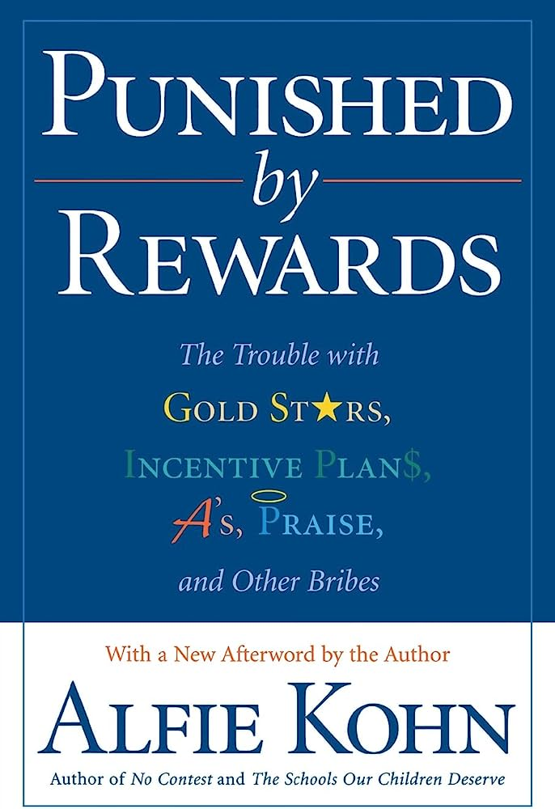

+++
title = 'The pursuit of happiness'
date = 2023-07-05T10:24:15+02:00
draft = false
tags = [ "happiness", "self-help" ]
author = "jmchor"
ShowReadingTime = true
ShowBreadCrumbs = true
ShowPostNavLinks = true
ShowWordCount = true
ShowRssButtonInSectionTermList = true
UseHugoToc = true

[cover]
image = "img/cover.png"
alt = "<alt text>"
caption = "<text>"
relative = false
hidden = false
linkFullImages = true
+++

Recently, I've been very concerned with the question of what it means to be happy, or what it means for me to be happy - so less of a search for the general phenomenon and more of a self-reflection type of search.

All of that started when I had the first psychotherapy session of my life. Already in the days before the appointment I felt myself be more "better" to myself and others - I expected some sort of cathartic moment talking to a therapist, and that expectation alone gave me a different perspective on how I conduct myself and the way I handle things.

Talking to and listening to my partner, especially in that regard (since she had already read so many things about the communication of emotions and such) helped me a great deal in formulating thoughts on what it was that I didn't want the way it was - be it how I perceive certain things or how I interact with people or (...). So that was already something extremely helpful, and it further boosted our communication as a couple since that was another avenue of topics we could go down together. We also had recently decided that our together-time (when our kid is sleeping) is much better spent without binging TV for binging TV's sake. Fun as the many many shows are, they can be immensely distracting from what else is going on.

### The right kind of input

But I didn't want to abstain from media input altogether (after all, I AM a developer and EVERYTHING is media). What I did in order to also have a positive effect on my recent "turn inwards", we may call it, was to look for podcasts. Everybody has a podcast on everything, so why not something like "self-therapy" or "dealing with frustration". What I did find and what turned out to be a GREAT find, was [The Happiness Lab](https://www.drlauriesantos.com/happiness-lab-podcast). Not to go too much into the product placement lane, but that podcast is really cool. It's really nice to listen to, it's incredibly engaging, and if you, like me, are interested in the extremely vague concept of "improving happiness" - then you are at the right place.

I basically listened to the podcast whenever I could - pushing my kid's stroller or bringing her to bed, doing dishes, cleaning up and so on. And I was baffled by how what was talked about (and mind you, of course I started with episodes from three years ago) was absolutely relevant to my process. Not that I can relate how star athletes to their athleting, but bits and pieces, a little advice here or a short description of a meditation technique there, hit just the right spot. Emphasizing over and over again how basic and important a bit of cardio and good sleep is to improve happiness just like that made me want to check it out. Reducing screen time for myself already improved my wellbeing (I do suffer from tension headaches), and more sleep and exercise could never hurt, right? Right! I mean, currently I'm super knocked out from transatlantic travel, but my state of mind is just different.

Another big thing in those episodes (and then I'm done talking about podcasts) was an interview with Alfie Kohn who wrote the book [Punished By Rewards](https://www.alfiekohn.org/punished-rewards/) in which he illustrates based on many studies how the application of punishments and rewards (even just a "good job"!) in workplace or child care can absolutely destroy our own motivation and excitement for things. And to make things even more interconnected: my partner had read that book in the previous year and has modeled the way she - and then I - relate to our child in accordance with Kohn's findings (and a ton of other sources ). So a new thing I was absolutely excited about was already connected to something one of the most important people in my life had already made into a big party of our lives - that realization gave me a fantastic mood boost, as you can imagine. Oh, and I started reading Kohn's book as well.

    
    Kohn's book unveils a lot of evidence on how rewards are no better than punishments - and sometimes even worse.

### The list

And again it is my partner who comes up with the best ideas - or, at least, says them out loud first. Recently we both had had the feeling that the things that we like doing in our "free time" (which in our case means that either our kid is sleeping and we have no appointments, or the other parent is running around with her) seem more like chores because we almost forcefully "need to get them done". For her it's puzzles, and for me it's currently a mix of gaming and drumming (the week before, the routine also needed to involve a bit of coding for my latest project). But that was exactly it: we both felt stressed to cross those things off our daily list so that they are done, and then - what? Because we didn't feel refreshed or relaxed after "getting in" our time with our hobbies, we just checked some boxes so that we don't feel bad if we didn't achieve our goals. We went right into the trap that Fitbits and all the measurement apps lure you into - quantify your successes and turn them into a basic requirement.

To get out of that spiral of not having fun with the things most fun to us, my partner had the idea to just extend the number of things we like doing to a level that we physically can not fulfill in a day, just because there is not enough time to do any of them properly if we tried to do them all. So instead of a having a list of the three things I like to do, I now have a list of at least ten items that are proven to make me happy. This is how [The Happy List](https://jmchor.notion.site/jmchor/The-Happy-List-6d1b8f6c41aa49bca3b9368b4061e887) came to be.

### Where to go from here

I guess the only question that really still is unanswered is: where to go from here? There are tons of resources out there concerning happiness and positivity, how to improve the self and so on and so on. The amount of information and books and articles on the topics of mental health and happiness is also an indicator of how big the problem in western societies is - it's always there, it's always prevalent, but people don't or can't prioritize happiness, and so more and more books on the topic are being written. Where to go from here? That completely depends on each and everyone of us individually. For myself I decided to go with the **practice-approach**: *immediately put to practice what I read or hear*. Meaning: I share it with my partner and talk to her about it. I write about it in a blog post or my journal, or I share it with someone who I think might benefit from a certain piece of information or a specific resource. But most of all: I practice it all on myself. Meditation, being honest with myself, talking myself through things. The only person I can truly motivate is myself, and all my interactions with other people start with how I treat myself - I believe this is how happiness can be achieved, by starting with ourselves.