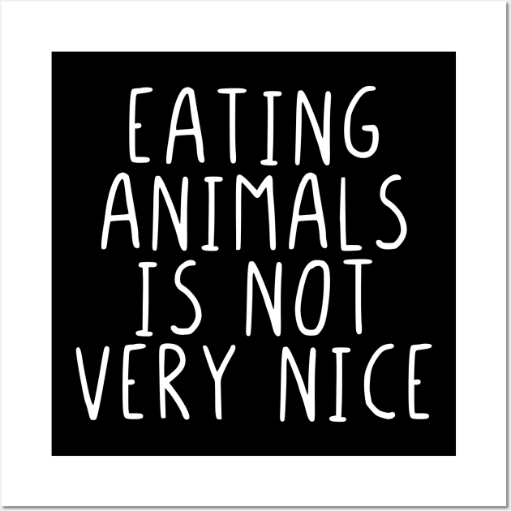
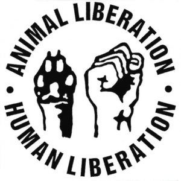
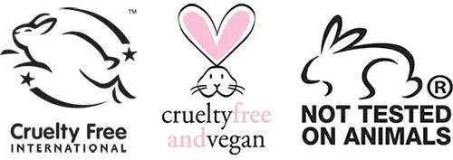
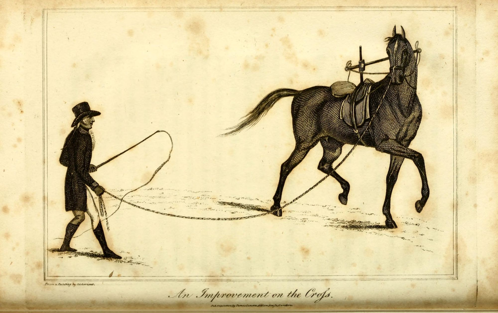

+++
title = "Why Vegans Don't .."
date = 2023-10-10T09:37:06+02:00
draft = true
tags = [ "veganism", "exploitation", "ethics" ]
author = "jmchor"
ShowReadingTime = true
ShowBreadCrumbs = true
ShowPostNavLinks = true
ShowWordCount = true
ShowRssButtonInSectionTermList = true
UseHugoToc = true

[cover]
image = "img/cover.png"
alt = "<alt text>"
caption = "<text>"
relative = false
hidden = false
linkFullImages = true
+++
## .. visit zoos, ride horses or sing along to "Baa baa black sheep"

Some things in life aren't very nice - actually, a lot of things in life can very not nice, if you think about it: war, famine, climate crisis (just to name a few global things), or stubbing your toe, fighting with a loved one, etc (to name a few very local things). The title is mainly referring to a slogan I saw on a T-shirt once:

    
    Source @teepublic

And that is just obviously the case. Eating animals is not very nice to the animals, and as it turns out, to the one *doing the eating as well* (unless you are a carnivorous animal, which humans just aren't). I think it is pretty established that vegans do not eat animals or animal products - but herein also lies a bit of the **problem**. Most people in western society connect the term *veganism* **exclusively** with a specific diet, and vegans are people following a diet that is viewed (mostly by non-vegans, carnists and the "regular" people) as **restrictive** and "not fun". But that's it then - vegans are those people that don't eat animals and who get in your face when you do. No more, no less. And I'm starting to really get *sick* of that.

### From food preference to sociopolitical position

Let me just get one thing out of the way: not only do I think that eating animals isn't very nice, I think it is a pretty f*** up thing to do, and it's even worse that it is so normalized in almost every society, the invisible dominating carnist culture. The other day (reading something about a non-vegan complaining about protein or something AGAIN) it just hit me - people who get their nutrients from eating animal flesh basically indulge in a less Bram-Stoker-esque form of vampirism. The lives of dozens brutally killed animals - for that of one human. Seems off to me, and if it were intentional, really evil. But I don't think we need to discuss the food aspect of veganism, since every non-vegan is more than happy to do that already.

Veganism, as I have already written about [here](https://blog.jmchor.dev/giving-a-damn/) and if I may quote myself, means

> to fight those structures built on the exploitation, torture and murder of billions of living beings

The structures in question here absolutely mean physical structures like slaughter houses, meat packing plants, factory farms, butcher shops and so on - those structures need to get gone.

But that is not all, not by a long shot. The structures we need to fight and get rid of are political structures like the subsidies for the dairy industry; in 2017, the US government paid more than [$36 billion](https://nupoliticalreview.org/2020/05/16/my-beef-with-dairy-how-the-us-government-is-bailing-out-a-dying-industry/#:~:text=One%20year%20after%20the%20passage,and%20%2436.3%20billion%20in%202017.) in direct and indirect subsidies to the dairy industry, while dairy farmers rob cows of their milk with such excess that they have to throw it away. And it's not that small farms are being supported to push the narrative of the idyllic American farm: the winners are the [handful](https://www.theguardian.com/environment/2023/jan/31/us-dairy-policies-hurt-small-farms-monopolies-get-rich) of mega-corporations in agribusiness. In the EU, it's no different: here, the EU government subsidizes the dairy industry with [€16 billion](https://policy-practice.oxfam.org/resources/milking-the-cap-how-europes-dairy-regime-is-devastating-livelihoods-in-the-deve-114549/) per year, with Germany pumping [€13 billion](https://gemeinsam-gegen-die-tierindustrie.org/studie-milliarden-tierindustrie/) into "livestock production" in general. But let's not devolve into throwing numbers around (a thing vegan activists are very often cornered into).

Veganism is a very political stance, because it is about the exploitation of others - predominantly about ending the exploitation of animals, and more specifically, giving a voice to the voiceless. This latter sentiment is the most important one to me, because it frames veganism as utterly intersectional. Veganism is thus not only concerned with the oppression of animals, but with oppression itself - of basically everybody who is not a White, heterosexual, cis-gendered male human (and I know this because I am a White, heterosexual, cis-gendered male human). Because we are attuned to the tortured existence of most animals on the planet, most of us are also attuned to how humans exploit and torture each other, based on sex, gender, race, religion, and so on. So, on a political scale, I would definitely say that ethical vegans can identify with the political fight for the oppressed - animal liberation and human liberation!

    

### Bunnies don't wear makeup

Can food be "vegan"? It's a misnomer, for sure - veganism is a moral philosophy, but the word "vegan" in English (as well as German) is used synonymously for "plant-based" when it comes to food items. It just makes the conversation a bit easier to ask for vegan food instead of asking if all ingredients in a meal are plant-based (or "komplett pflanzenbasiert", as the Germans would probably say). In English, there is also "vegan friendly" for products that are suitably for a plant-based diet. So it's a semantic convenience to call food "vegan", but it also creates this connection between eating and veganism, which very often is the only connection most non-vegans see and so they think, they only thing vegans do different than other people, is to not eat animal products. Which is understandable but at the same time wrong and can get pretty annoying - because vegans object to any and all exploitation and oppression, not "just" the torture and killing of farmed animals. Another big area of what ethical vegans fight against is the vivisection and animal testing industry - you know, actual lab rats and such.

A lot of, if not most of all medications and vaccines available for humans has been tested on animals - mice, rats and monkey - to see if there are any side effects for humans. This is still kind of a grey area (there would not have been a polio vaccine, for example) for extremely basic vaccines and medications. But there can't be any discussion of the necessity of animal medical testing, now that more and more other means of medical testing are becoming ubiquitous (like synthetic cell scaffolding, 3D printing and computer models) - also, these tests can be less than conclusive; all they produce are the reactions of certain medications in the test subjects, not humans. So what's the point?

And there sure as hell is no reason whatsoever to torture animals for cosmetic products - especially since there have essentially not been any new inventions since soap, just unnecessary derivatives of it. The Draize Test to check what irritates the eyes of a test subject (used on bunnies in rigid contraptions) is extremely pointless. And bombarding monkeys with radiation and poison to see how long they can hold out till they die a horrible death? Monkeys don't fight your wars. Bunnies don't wear makeup. And mice don't drink diet coke in the amounts to have cancer spawn in them - so don't make them.

    

### Vegans don't wear bunnies

This should be kind of obvious, but I'll write it down anyways: vegans, apart from not wanting to consume animal products in a caloric manner also do not participate but actually oppose the consumption of animals bodies as a whole. This means: no animals skin for jackets, purses, wallets, belts or hats. No tattoos inked using a lanolin (sheep wool fat) stencil. No food containing sugar whitened with bone char (which is, you guessed it, bone). No clothing made from sheep's wool (and the argument that sheep need to be shorn is moot - they need to be shorn because humans twisted them into the creatures they are now, overgrowing their coat every year. What to do with the wool? Throw it away.) And so on and so on and so on. You get the point.

<a href="https://www.peta.org.uk/blog/jona-weinhofen-heres-the-rest-of-your-wool-coat/" target="_blank">Here's the rest of your coat</a>

 

So far, ethical vegans are against farming animals for food and drink, using them for scientific research, vivisection and animal research, as well as wearing their skin or any items made from their bodies. What else do vegans oppose?

### The Entertainment Trap

The exploitation of animals is not done with the disregard for their life and the mutilation and desecration of their bodies in order to physically consume them, as in eat them and wear them. Humans also found a way to consume what animals can be made to do. The entertainment industry around imprisoned animals is huge - the captive non-human slaves on display are so ubiquitous that most people have a heard time thinking of it. What I'm talking about are zoos.

More than once I hear other parents say "let's go get the kids to the zoo, it's fun!" or "oh, they have an aquarium, how nice!", and all I can think about is how I would feel if somebody else came to gawk at me through a window in a room that I can't leave. In an area that is walled off and where I have been made so dependent on human beings (by human beings) that without their benevolence and support, I would die. But is it really benevolence and support that keeps a museum object alive? Or is it the goal for continuous exploitation, revenue, customers or what have you that drives the "animal care" in zoos and enclosures.

Same goes for things like Seaworld where animals are made to perform for humans - you know, like in the Colosseum in Rome, where slaves were made to entertain the masses. It's astonishing that most people do not see the connection, the equivalency of suffering.

Or what about the "sport" of bull fighting? The bull who's being injured and tortured and mocked by the bull fighters, who outnumber the bulls only to ultimately kill them and call it a "victory".

How about rodeos? Where cows are cornered and brought into an anxious-aggressive state only to be caught and bound, ripped around so that they suffer whiplash and tremendous injuries to their heads and legs? What about the horses that are forced to carry the rider?

  
   

    
I'm a huge animal-lover!

     almost all carnists, not seeing the irony 
    

     
      

And speaking of horses. There are so many people out there who proclaim to love horses (then again, there are tons of meat-eaters out there who happily pronounce their love for all animals while chewing on a piece of dead body). But horses are weirdly different - the adjective most often used in connection with horses is "majestic", "free" or "spirited" - all those things horses ceased to be when humans got their hands on them. Don't get me wrong - I also think horses are majestic and cute and cuddly, but most of all I think that they should be left alone.

Humans mistreat animals on a large scale, and while horses are not farmed for their meat or milk (at least not in the Western world), they're enslaved for their work power (I mean, we even call the strength of an engine *Horse Power*) and their "entertainment value", be it for commercial advertisement (like in [Budweiser beer commercials](https://investigations.peta.org/anheuser-busch-amputates-budweiser-clydesdales-tails/)), movies or on a horse farm for tourists to ride  - only recently I had to read a post on the Internet where parents happily reported that their kid "got to" ride the horse.

    
    If one person has to hold a whip, there can't be any respect in a relationship.

 

[**Vegans don't ride horses**](https://veganfta.com/2022/10/12/why-vegans-dont-ride-horses/) because all beings should be considered equal - and climbing onto another being's back is literally putting yourself above them. Horses are in pain when they are ridden  - sure, they're big, but have you ever had a small child riding *your* back for a longer period of time? It hurts. And for those out there proclaiming that horses need exercise: absolutely, as we all do. Maybe just don't sit on their f***g back.

"Sports" like horse jumping or horse racing put a kind of stress on the horse's body it is [**not made for by nature**](https://www.peta.de/themen/pferde-reiten/) - horses stand a lot, run for short distances if they please, and then they stand around again.

In short: if you ride a horse, or if you let your kids ride a horse, visit a zoo or an aquarium - just be aware that you're contributing to the enslavement of fellow beings for the short and dubious pleasure of entertainment.

### The Black Sheep

But a children's song can't be bad, can it?

Of course, that is debatable. But in essence, the argument here is: how we talk shapes our reality, because words have power. It's only through words and images that we can convey our own thoughts to the next being, and so it matters a lot what words we use. Have you ever wondered, why the English language has specific words for the flesh of pigs and cows - both adult and baby? Words like "pork", "beef" and "veal" are supposed to mask what is actually being talked about - body parts, dead flesh where once was a living being, killed for sensory pleasure. (Funnily in enough, German doesn't make any such distinction).

So it is very import what words we use, and how we use them. A children's song like "Baa baa black sheep" might of course come across as innocent - after all, that's something we teach our children. (Again, that reason alone might not be a reason at all if you are familiar with the German "Struwwelpeter").

Baa Baa Black Sheep is an English nursery rhyme from the 18th century, which goes like this

> Baa, baa, black sheep,Have you any wool?Yes, sir, yes, sir,Three bags full.One for my master,One for my dame,And one for the little boyWho lives down the lane.

While nursery rhymes are being sung to children because they're easy to remember and the melodies stick, the content of this particular one also has a different side effect: **normalizing exploitation** as well as stipulating a *natural* order of beings - the sheep is offering the wool off their back (literally) to their "master". Languages (at least in Western societies) are going through lengths to normalize animal exploitation and abuse, most often in places where you least suspect it - **children's songs** and **nursery rhymes** are only a little part of it. Tons of colloquial **idioms**, phrases and sayings which depend on the cultural background can vary a lot - and still, in most of them the animal motif is used in a exploitative and pejorative manner. Examples include:

-   the bull in the china shop (the bull being an image of unrestricted aggression, even though bulls are only aggressive when attacked.)
-   being dirty or sweaty like a pig
-   being as dumb as a cow
-   monkeying somebody

Animals are being used as stand-in for qualities humans deem negative in themselves (while the actual animals don't even have those qualities at all). A popular saying involves the murder of two birds with just one rock, aiming to invoke an image of efficiency - but really only normalizing taking the life of an animal, or, even worse, not even realizing that you are talking about taking an animal's life.

Vegans pay attention to their language and are mindful of their actions, and while a lot of people joke about efforts to change sayings (like [PETA](https://www.peta.de/themen/speziesismus-sprache/) did), aiming towards a more inclusive language will also change your state of mind. Another big problem aside from sayings and phrases is the way people talk about animals - [as an "it", and not as a "who"](https://www.all-creatures.org/articles/act-counter-speciesism-language.html). Animals have personalities just in the way humans have personalities: likes and dislikes, specific patterns of behavior, ways to communicate with other animals. A lot of humans (if not most?) are very human-centric and are trying to compare non-human animals to human standards: if a chicken can't display the same math skills as a human, the chicken must be dumb (while chickens are capable of solving mathematical [problems](https://www.scienceworld.ca/stories/chickens-can-do-math/)). And if a chicken is just a dumb animal, it's just a dumb brute, which can't have a personality, so it's fine to eat them, right? Wrong. Chickens exhibit all the signs of stress and joy attributed to sentience, thus they deserve the same regard as anybody else. As a "who", not an "it".

### Why Vegans Don't

The perception of vegans and veganism in general is quite often a restrictive one. Or, as someone once told me:

<aside>
    "You vegans never laugh, you never have fun, and you built such a restrictive world around you. All you can talk about is veganism!"
</aside>
  

The thing is - I can totally see the point with the "restrictive world". At least from the viewpoint of someone who goes about their day without reflecting on what they put in their bodies and why, as well as on their privilege and status in life. Words like "vegan", "halal", "kosher" or "gluten-free" seem restrictive to a person who can just shovel whatever seems edible into their faces, and will do that without a second thought and maybe happily so. In short: it's the ignorance that comes with a seeming state of bliss, allegedly being free to do whatever you like.

Being vegan means being aware - aware of the world around you and aware of the fact that humans are not isolated beings at the top of a food chain. Being vegan means to be attuned to the vast network of interconnected beings this world in reality is. When you eat a hamburger, you don't eat an isolated thing that's called a hamburger - you eat a piece of flesh of a creature that was once alive, a sentient being that was tortured by cramped spaces and isolation and force-fed on the wrong diet and antibiotics, and then killed in what was highly likely a painful process of electric shocks and bolts and panic. Being vegan means to extend the concept of morality to absolutely everything in your life, to even the most basic things like eating, drinking and cleaning yourself.

And as for the fact that vegans seemingly don't shut up about veganism? Non-vegans never shut up about carnism. It's ubiquitous, and because it is the dominant culture worldwide, it's almost invisible, quiet, and thus all the more destructive.

Vegans don't shut up about veganism because that is very likely what the animals would want us to do.